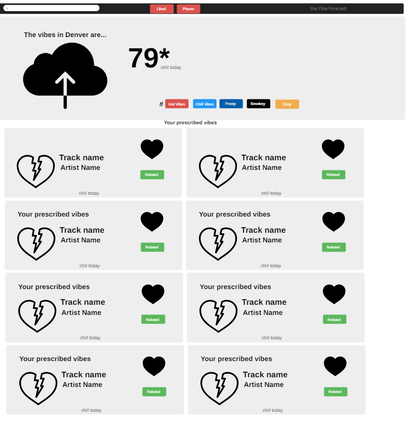

# theVibeForecast

As a musically inclined weather enthusiast

I want to enter in my current city

So I can see the current weather

I want to be able store a few cities in the navigation bar

So I can save the last few cities I searched

I want to listen to songs that relate to the weather vibes in the city

So I can listen to the songs

I want to be able to like and save songs

So that I can replay songs that I liked.

# nav bar

-will include searchbar that allows the user to choose their location for weather data pull

-include the name of our project

# jumbotron

-display local weather

-will display the music hashtags that will be given to you based on the weather

# track container

-will display 8 tracks in 8 seperate card containers

-each card will diplay track ID, related tags, like button(add to local storage)

# aside container

-when a track is liked it will be added to this container

-this container will also show saved cities

# footer container

-digital media agency business name "created by The Vibe Doctors"

-will include links to each one of our github accounts

# screenshot of wireframe

